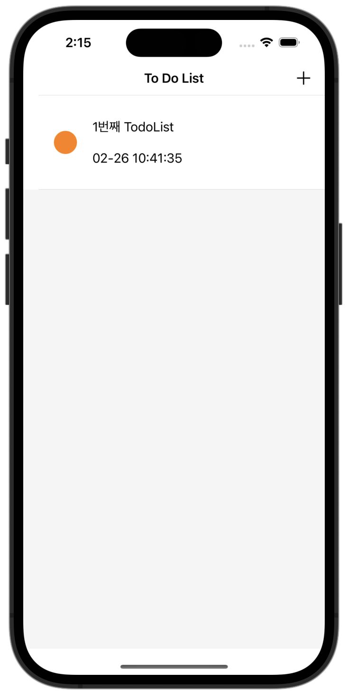
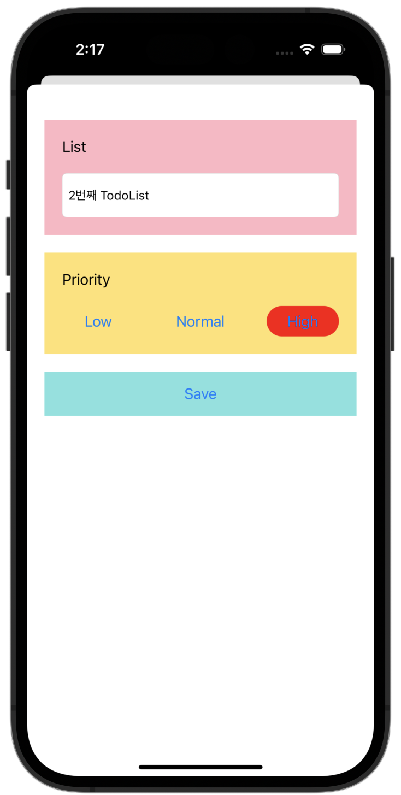
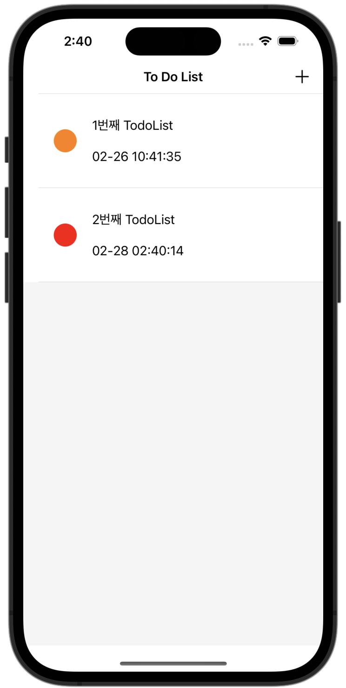
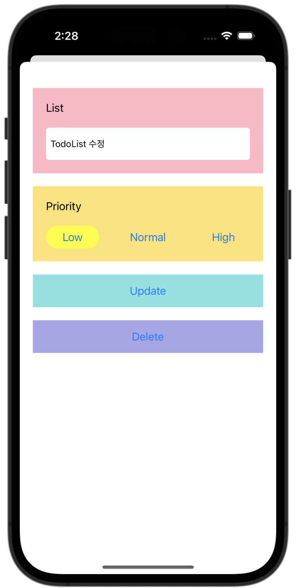
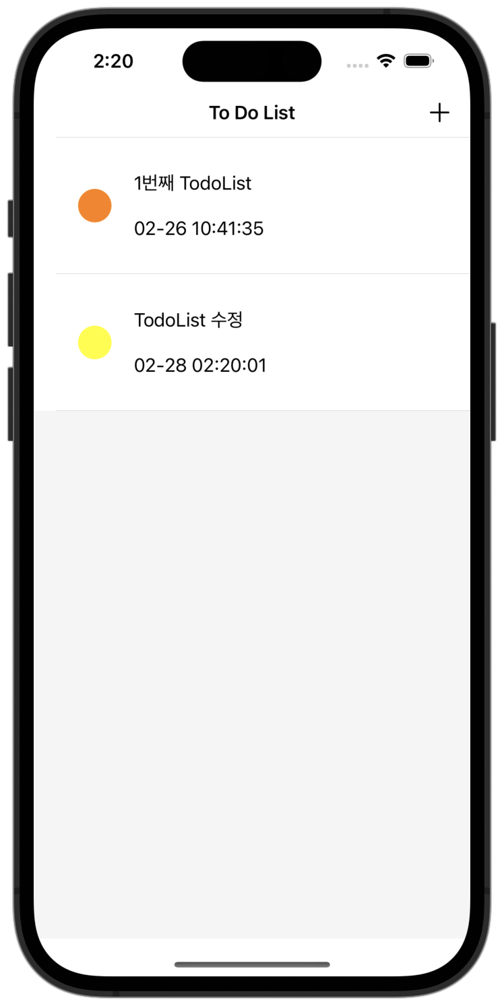

# Todo_App
---
## 프로젝트 목적
* TodoList를 작성하고 우선순위를 선택하여 추가, 수정, 삭제할 수 있는 앱 서비스입니다. 입력한 데이터를 저장하고 로드할 수 있는 CoreData를 학습하기 위한 프로젝트입니다.
---
## 프로젝트 설명
* 사용기술


  
  
* 개발환경


   
 
* 기능설명
  - [+] 버튼을 클릭하여 원하는 내용을 텍스트 필드에 작성할 수 있습니다. 
  - 사용자가 생각하는 중요도에 맞게 우선순위를 3단계로 선택할 수 있습니다.
  - 수정 혹은 삭제하고 싶은 목록을 선택하여 내용과 우선순위를 수정 또는 삭제할 수 있습니다.  

      

* 프로젝트 구조  

<table>
<tbody>

<tr>
    <td><b>ViewController.swift</b></td>
<td>앱의 시작화면에 대한 파일입니다. 테이블 뷰에 대한 내용과 저장된 데이터를 불러오는 함수(fetchData())로 구성되어 있습니다.</td>
</tr>

<tr>
    <td><b>TodoDetailViewController.swift</b></td>
<td>리스트를 추가, 수정, 삭제할 수 있는 디테일 화면에 대한 파일 입니다. 저장을 위한 함수(saveTodo()), 수정을 위한 함수(updateTodo()), 삭제를 위한 함수(deleteTodo())로 구성되어 있습니다. </td>
</tr>

<tr>
    <td><b>TodoCell.swift</b></td>
<td>테이블 뷰 셀에 대한 아울렛이 연결되어있는 파일입니다.</td>
</tr>

<tr>
    <td><b>TodoDetailViewController.xib</b></td>
<td>디테일 화면을 구성하는 xib 파일입니다.</td>
</tr>

<tr>
    <td><b>Main.Storyboard</b></td>
<td>시작 화면을 구성하는 storyboard 파일입니다.</td>
</tr>


</tbody>
</table>

* 실행방법  
```
1. Clone this repository.
2. Run Xcode and excute project.
```